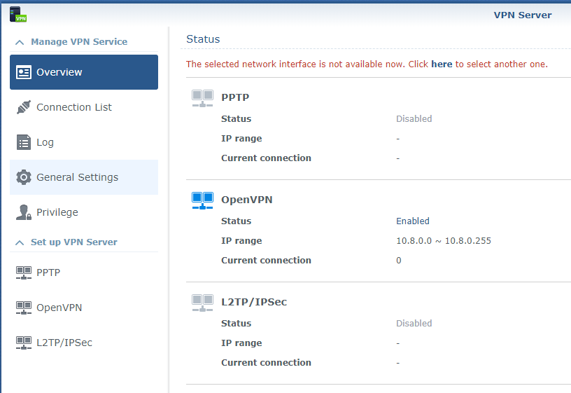
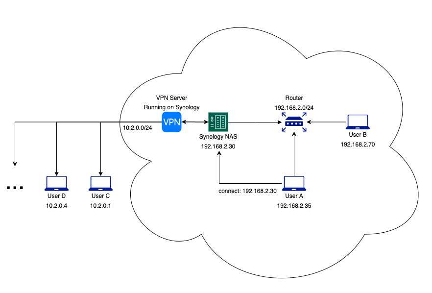

# 🔐 Synology VPN Setup Guide


Panduan lengkap mengatur **VPN Server di Synology NAS** (OpenVPN, PPTP, L2TP/IPSec), termasuk konfigurasi port dan firewall.

## 📂 Struktur Folder
- `assets/` → Gambar pendukung
- `docs/` → PDF panduan
- `config/` → Contoh konfigurasi OpenVPN

## 📷 Screenshot



## 📄 Panduan
📄 [Unduh Panduan PDF](docs/panduan-setup-vpn-synology.pdf)  
🔐 [Download Konfigurasi OpenVPN](config/synology-vpn-client.ovpn)

## ⚙️ Contoh Konfigurasi OpenVPN

```bash
client
dev tun
proto udp
remote yourdomain.synology.me 1194
resolv-retry infinite
nobind
persist-key
persist-tun
auth-user-pass
comp-lzo
remote-cert-tls server
cipher AES-256-CBC
auth SHA256
verb 3
```

## 🧠 Tips
- Aktifkan QuickConnect/DDNS
- Forward port UDP 1194 ke NAS
- Gunakan OpenVPN untuk keamanan optimal

## 👤 Kontributor
**Rizki Caesar Noverdian**  
[GitHub](https://github.com/caesarnoverdian) | [LinkedIn](https://linkedin.com/in/rizki-caesar-noverdian-5296b9a4)

## 📜 Lisensi
Proyek ini menggunakan [MIT License](LICENSE)
